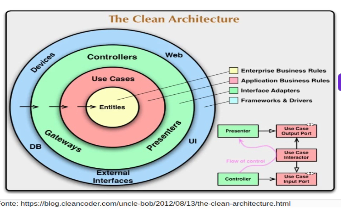
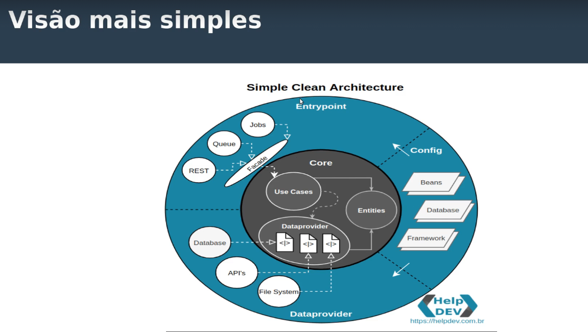
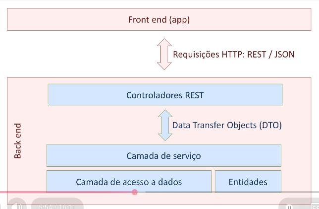

# Clean Architecture (anotações)

Notas de estudo sobre Clean Architecture, base conceitual deste projeto.

**Referência:** [Descomplicando a Clean Architecture (Luizalabs)](https://medium.com/luizalabs/descomplicando-a-clean-architecture-cf4dfc4a1ac6)
Autor original do conceito: Robert C. Martin (Uncle Bob).

## A ideia central

Uma maneira mais simples e reutilizável de organizar o código, mantendo o **core da aplicação
totalmente isolado do mundo externo**.

Faz parte da mesma família de arquiteturas que buscam esse isolamento:

- Arquitetura Hexagonal (Ports & Adapters)
- Onion Architecture

A regra principal: **o acesso é sempre de fora para dentro**. As dependências apontam para o
centro, nunca o contrário.



## As camadas

| Camada | Cor | Responsabilidade |
|--------|-----|------------------|
| **Entities** | centro | Classes de domínio (objetos de negócio da aplicação) |
| **Use Cases** | centro | Regras de negócio específicas (controle de fluxo, orquestração) |
| **Interface Adapters** | verde | Camada de comunicação entre o mundo interno e o externo |
| **Frameworks & Drivers** | azul | O mundo externo (banco, HTTP, mensageria) |

> A maior dificuldade de aplicar a Clean Architecture é justamente manter essa disciplina de
> dependências e a separação entre as camadas.

## Organização em pastas



```bash
core
├── dataprovider   # interfaces de saída do core (como a aplicação "sai" para o mundo)
│   └── client     # contratos para acessar outros microsserviços
├── domain         # classes de domínio
└── usecase        # casos de uso (regras de negócio)

dataprovider       # implementações das interfaces de saída
├── client
└── repository

entrypoint         # tudo que é forma de acesso à aplicação
├── controller     # REST
└── consumer       # Kafka
```

## Comparação com o padrão em camadas do Spring



| Padrão em camadas (Spring) | Clean Architecture |
|----------------------------|--------------------|
| Entity (model)             | `core.domain`      |
| Services                   | `core.usecase`     |
| Controllers / DTOs         | `entrypoint`       |
| Repository                 | `dataprovider`     |

## Glossário

- **POJO** (*Plain Old Java Object*): classe Java comum, sem amarração a nenhum framework,
  especificação ou interface especial. As classes de `core.domain` são POJOs justamente para
  manter o domínio livre de bibliotecas.
- **Port (porta):** interface definida no `core` que descreve uma saída para o mundo externo.
- **Adapter (adaptador):** implementação concreta de uma porta, onde o framework é permitido.
